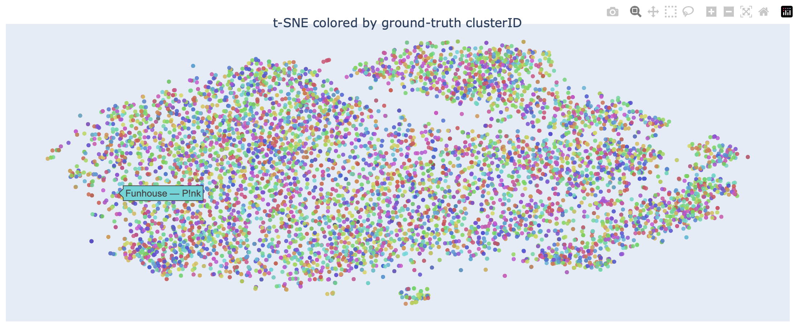

# Encoding short music videos with MERT and [CLMR](https://github.com/Spijkervet/CLMR)

## Evaluation
- Base MERT and CLMR models was evaluated with purity scores (`train_test/eval.py`) and an interactive tSNE visualization of encoded tracks `train_test/generate_tsne_report.py`, allowing the user to hover over clusters and hear samples of nearby songs

- Download the HTML reports in `figures/clmr_base_tsne_report.html` and `figures/mert_base_tsne_report.html` for an interactive report. Tracks won't play unless previews are downloaded based on `data/get_dataset.py`

## Getting Data
- A large dataset of similar tracks was generated through Spotify user's playlists, Last.fm's get_similar API, and tracks of the same album `data/get_dataset.py`
- Audio samples were preprocessed to single channel, and downsampled to proper sampling rate based on model (24kHz for MERT and 22.5kHz for CLMR)
- Embeddings were stored locally and used for evaluation and report generation.

## Running
- Currently, the dataset for model evaluation is not publicly available

## Future Goals
- This project is currently on pause while I am busy working on other ML/Bioinformatics projects
- In the future, I'd like to train MERT with a contrastive learning objective from the data generated in `/data`, and fully integrate these models into my [full stack web app](https://github.com/jaaxk/spotify-pzn-web-app)
- The app should generate playlists for users based on actual sound embeddings, rather than collaborative filtering
